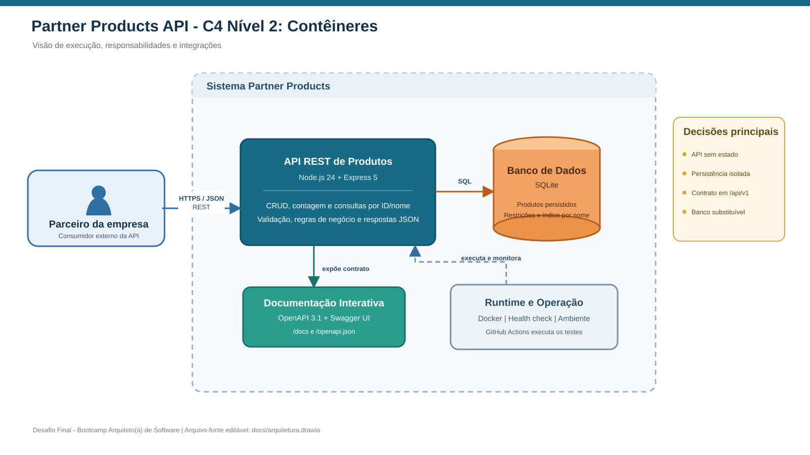

# Partner Products API

API REST de Produtos desenvolvida para o Desafio Final do Bootcamp
**Arquiteto(a) de Software**. A solução usa JavaScript, Node.js, Express,
arquitetura MVC e persistência SQLite.

[](https://github.com/ronoellima10-ship-it/desafio-final-arquiteto-software-api/actions/workflows/ci.yml)

## Entregáveis

- [Relatório técnico final em PDF](docs/entregavel-final-arquitetura-software.pdf)
- [Diagramas da arquitetura em PDF](docs/diagramas-arquitetura.pdf)
- [Arquivo editável do draw.io](docs/arquitetura.drawio)
- [Decisão arquitetural ADR-001](docs/ADR-001-node-express-sqlite.md)

## Arquitetura



O fluxo principal é:

`Cliente HTTP -> Middleware -> Route -> Controller -> Service -> Repository -> SQLite`

Na adaptação do MVC para uma API REST:

- **Model:** representa e valida Produto e participa da camada de dados.
- **Controller:** recebe a requisição HTTP e produz status e representação JSON.
- **View:** é a representação JSON entregue ao parceiro.
- **Service:** mantém as regras de negócio fora do Controller.
- **Repository:** isola SQL e persistência, permitindo trocar o banco com menor impacto.

## Funcionalidades

- CRUD completo de produtos.
- Contagem total de registros.
- Listagem de todos os registros.
- Consulta por ID.
- Pesquisa parcial por nome, sem diferenciar maiúsculas e minúsculas.
- Persistência em SQLite com restrições e índice.
- Validação de entrada e respostas de erro padronizadas.
- OpenAPI 3.1 e Swagger UI.
- Testes automatizados de integração.
- Docker, health check e pipeline de integração contínua.

## Tecnologias

- JavaScript (ES Modules)
- Node.js 24
- Express 5
- SQLite nativo (`node:sqlite`)
- Zod
- OpenAPI 3.1 + Swagger UI
- Vitest + Supertest
- Docker + GitHub Actions

## Executar localmente

Requisito: Node.js 24 ou superior.

```bash
npm ci
cp .env.example .env
npm run seed
npm start
```

A API ficará disponível em `http://localhost:3000`. A documentação interativa
estará em `http://localhost:3000/docs`.

Para desenvolvimento com recarregamento automático:

```bash
npm run dev
```

## Executar com Docker

```bash
docker compose up --build
```

O volume `product_data` preserva o banco entre reinicializações.

## Endpoints

| Método | Rota | Finalidade |
|---|---|---|
| `GET` | `/health` | Health check |
| `GET` | `/api/v1/products` | Listar todos |
| `GET` | `/api/v1/products/count` | Contar registros |
| `GET` | `/api/v1/products/:id` | Buscar por ID |
| `GET` | `/api/v1/products/name/:name` | Buscar por nome |
| `POST` | `/api/v1/products` | Criar |
| `PUT` | `/api/v1/products/:id` | Atualizar |
| `PATCH` | `/api/v1/products/:id` | Atualizar parcialmente |
| `DELETE` | `/api/v1/products/:id` | Excluir |
| `GET` | `/docs` | Swagger UI |
| `GET` | `/openapi.json` | Contrato OpenAPI |

### Exemplo de criação

```bash
curl -X POST http://localhost:3000/api/v1/products \
  -H "Content-Type: application/json" \
  -d '{
    "name": "Notebook Pro 14",
    "description": "Notebook profissional com 16 GB de RAM.",
    "price": 5499.90,
    "stock": 15,
    "active": true
  }'
```

## Estrutura de pastas

```text
.
├── .github/workflows/ci.yml       # Integração contínua
├── data/                           # Banco SQLite local (ignorado pelo Git)
├── docs/
│   ├── arquitetura.drawio          # Diagrama editável em duas páginas
│   ├── diagramas/                  # Exportações vetoriais
│   ├── diagramas-arquitetura.pdf   # Entregável visual
│   └── entregavel-final-arquitetura-software.pdf
├── scripts/seed.js                 # Dados de demonstração
├── src/
│   ├── config/                     # Banco e OpenAPI
│   ├── controllers/                # Entrada e saída HTTP
│   ├── errors/                     # Erros de domínio/aplicação
│   ├── middlewares/                # Aspectos transversais
│   ├── models/                     # Entidade e validação
│   ├── repositories/               # Persistência SQL
│   ├── routes/                     # Rotas REST
│   ├── services/                   # Casos de uso e regras
│   ├── app.js                      # Composição da aplicação
│   └── server.js                   # Inicialização do servidor
└── tests/                          # Testes de integração da API
```

## Testes

```bash
npm test
```

Os testes usam SQLite em memória e cobrem disponibilidade, CRUD, contagem,
consulta por nome, validação, conflito e rota inexistente.

## Autor

Ronoel Lima — Desafio Final do Bootcamp Arquiteto(a) de Software, 2026.
