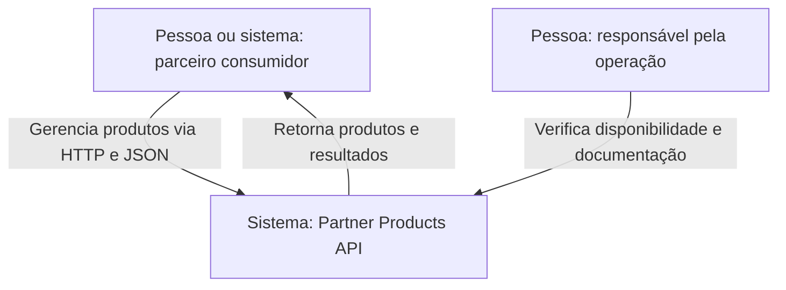
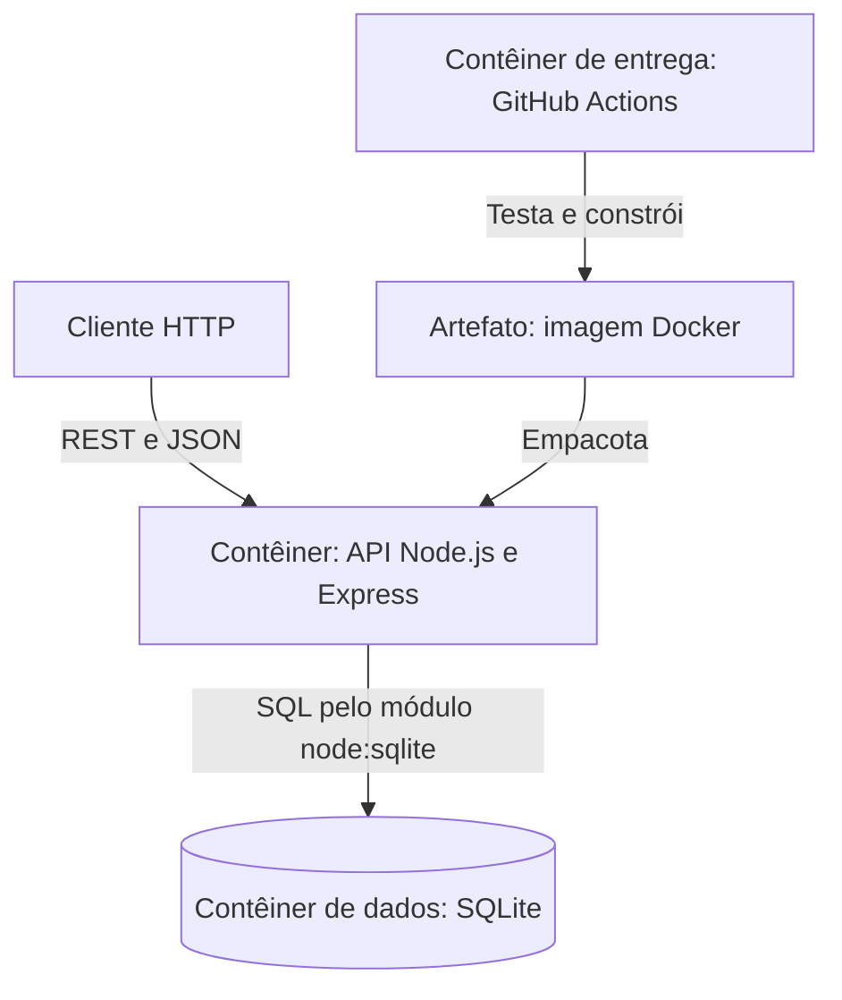
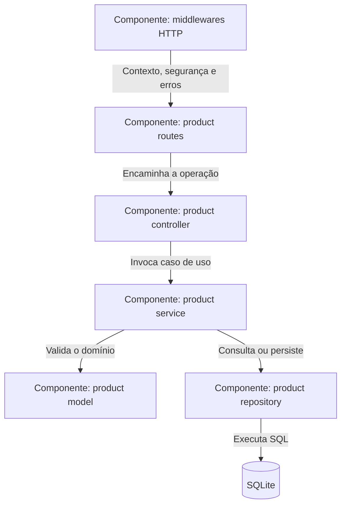
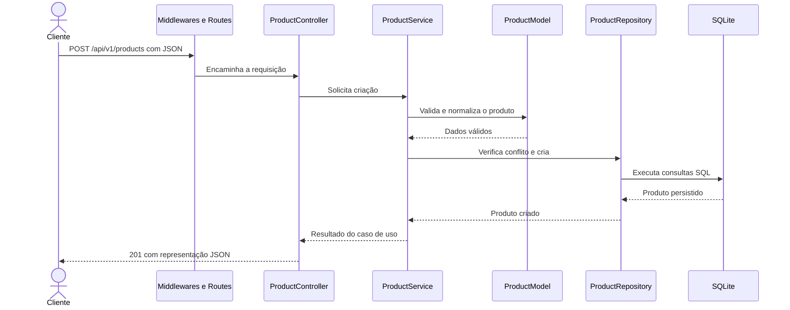

# Partner Products API — C4 Model

[README](../../README.md) · [Português](#português) · [English](#english)

Documentação baseada no código do repositório em 20 de setembro de 2026.  
Architecture documentation based on the repository code as of September 20, 2026.

## Português

### Nível 1 — Contexto do sistema

### Nível 2 — Contêineres

### Nível 3 — Componentes da API

### Fluxo principal — criar produto

### Artefatos visuais e decisões

- [Diagrama C4 de contêineres em SVG](../diagramas/c4-conteineres.svg)
- [Diagrama dos componentes MVC em SVG](../diagramas/mvc-componentes.svg)
- [Diagramas consolidados em PDF](../diagramas-arquitetura.pdf)
- [Fonte editável do draw.io](../arquitetura.drawio)
- [Estrutura e componentes](../estrutura-e-componentes.md)
- [ADR-001: Node.js, Express e SQLite](../ADR-001-node-express-sqlite.md)

## English

### System context

Partner consumers manage products through an HTTP and JSON API. An operator uses the same system to inspect health and the interactive API documentation.

### Containers and components

The Node.js and Express container owns the HTTP boundary and serves the OpenAPI contract. Requests cross middleware, routes, controller, service, domain model, and repository before reaching SQLite. GitHub Actions tests the code and validates the deliverable, while Docker packages the runtime.

### Key decisions and boundaries

- The layered design keeps HTTP concerns, business rules, and persistence separate.
- The repository boundary limits the impact of replacing SQLite in the future.
- Native `node:sqlite` reduces infrastructure needs but requires Node.js 24 or newer.
- JSON is the View in this REST adaptation of MVC.
- OpenAPI, automated integration tests, Docker, and CI make the architecture executable and verifiable.

## Evolution notes

SQLite is suitable for this challenge and small deployments. Higher write concurrency or horizontal scaling would require a shared database such as PostgreSQL, together with authentication, authorization, observability, and a production deployment strategy.
